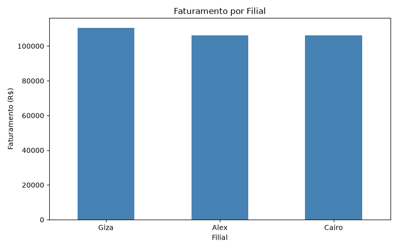
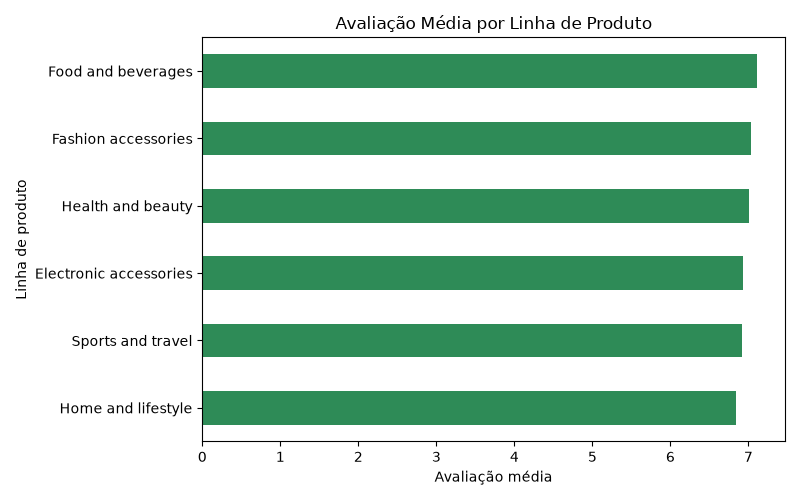

# Análise de Vendas de Supermercado

Pipeline de análise de dados de vendas de supermercado utilizando **PostgreSQL**, **SQL** e **Python (Pandas)**, construído como projeto avaliativo do Módulo 1 da trilha de Análise de Dados.

Fonte dos dados: [Supermarket Sales (Kaggle)](https://www.kaggle.com/datasets/faresashraf1001/supermarket-sales) — 1.000 registros, 17 colunas.

## Tecnologias utilizadas

- **PostgreSQL 17** — banco de dados relacional, camadas Raw e Tratada
- **Python 3.13**
- **Pandas** — limpeza, tipagem e transformação dos dados
- **SQLAlchemy + psycopg2** — conexão do Python com o PostgreSQL
- **python-dotenv** — proteção de credenciais (senha do banco fora do código)
- **Matplotlib** — geração dos gráficos
- **Git / GitHub** — versionamento

## Estrutura do projeto

```
projeto-analise-vendas/
├── sql/
│   ├── 01_criar_banco.sql      # Criação do banco de dados

│   ├── 02_criar_tabelas.sql    # Criação das tabelas Raw e Tratada, com constraints

│   ├── 03_consultas.sql        # Consultas SQL e exportação para CSV

│   └── carga_raw.sh            # Script de carga da camada Raw

├── src/

│   ├── 01_leitura_dados.py     # Leitura e inspeção inicial dos dados

│   ├── 02_etl_vendas.py        # ETL: limpeza, tipagem e colunas derivadas

│   └── 03_estatisticas.py      # Estatística descritiva e perguntas de negócio

├── data/

│   ├── raw/                    # Dados originais (CSV) e exportações do SQL

│   └── processed/              # Dados tratados (vendas_tratadas.csv)

├── resultados/

│   ├── estatisticas/           # Métricas em CSV (metricas.csv)

│   └── graficos/                # Gráficos gerados (.png)

├── requirements.txt

└── .gitignore
```


## Arquitetura de dados

| Camada | Descrição | Onde fica |
|---|---|---|
| **Raw** | Cópia fiel dos dados originais do CSV, sem alterações | Tabela `raw_vendas` / `data/raw/` |
| **Tratada** | Dados limpos, tipados e com colunas derivadas | Tabela `vendas_tratadas` / `data/processed/vendas_tratadas.csv` |
| **Resultados** | Métricas de negócio e visualizações | `resultados/` |

## Dicionário de dados — camada Tratada

| Coluna | Tipo | Restrições |
|---|---|---|
| id_venda | VARCHAR(50) | PRIMARY KEY, NOT NULL |
| filial | VARCHAR(10) | NOT NULL |
| cidade | VARCHAR(100) | NOT NULL |
| tipo_cliente | VARCHAR(50) | — |
| genero | VARCHAR(20) | — |
| linha_produto | VARCHAR(150) | NOT NULL |
| preco_unitario | NUMERIC(10,2) | CHECK >= 0 |
| quantidade | INTEGER | CHECK > 0 |
| imposto | NUMERIC(10,2) | CHECK >= 0 |
| valor_total | NUMERIC(12,2) | CHECK >= 0 |
| data_venda | DATE | Convertido de texto para data |
| hora_venda | TIME | Convertido para horário |
| forma_pagamento | VARCHAR(50) | NOT NULL |
| custo_mercadoria | NUMERIC(12,2) | CHECK >= 0 |
| margem_percentual | NUMERIC(10,2) | — |
| receita_bruta | NUMERIC(12,2) | CHECK >= 0 |
| avaliacao | NUMERIC(4,2) | CHECK entre 0 e 10 |
| dia_semana | TEXT | Coluna derivada, calculada a partir de `data_venda` |

## Como executar

### 1. Pré-requisitos

- PostgreSQL 17 instalado e em execução
- Python 3.13 com `venv`

### 2. Configurar o ambiente

```bash
python3 -m venv .venv
source .venv/bin/activate
pip install -r requirements.txt
```

### 3. Configurar credenciais

Crie um arquivo `.env` na raiz do projeto (não é versionado) com a senha do usuário `postgres`:

DB_PASSWORD=sua_senha_aqui

### 4. Criar o banco e as tabelas

```bash
sudo -u postgres psql < sql/01_criar_banco.sql
sudo -u postgres psql -d analise_vendas_supermercado < sql/02_criar_tabelas.sql
```

### 5. Carregar os dados brutos (camada Raw)

```bash
bash sql/carga_raw.sh
```

### 6. Rodar as consultas SQL e exportar para CSV

```bash
sudo -u postgres psql -d analise_vendas_supermercado < sql/03_consultas.sql
```

### 7. Rodar o pipeline em Python

```bash
python src/01_leitura_dados.py
python src/02_etl_vendas.py
python src/03_estatisticas.py
```

O `02_etl_vendas.py` grava o resultado tanto em `data/processed/vendas_tratadas.csv` quanto na tabela `vendas_tratadas` do banco. O `03_estatisticas.py` gera as métricas e os gráficos finais.

## Resultados — Perguntas de negócio

| Pergunta | Resposta |
|---|---|
| Qual filial apresentou o maior faturamento? | Giza (R$ 110.568,71) |
| Qual filial realizou a maior quantidade de vendas? | Alex (340 vendas) |
| Qual linha de produto apresentou o maior faturamento? | Food and beverages (R$ 56.144,84) |
| Qual linha de produto recebeu a melhor avaliação média? | Food and beverages (7,11) |
| Qual foi a forma de pagamento mais utilizada? | Ewallet (345 vendas) |
| Qual foi o valor médio das vendas? | R$ 322,97 |
| Qual foi a maior venda registrada? | R$ 1.042,65 (id 860-79-0874) |
| Em qual dia da semana ocorreu a maior quantidade de vendas? | Sábado (164 vendas) |

Métricas completas em [`resultados/estatisticas/metricas.csv`](resultados/estatisticas/metricas.csv).

### Gráficos

**Faturamento por filial**



**Avaliação média por linha de produto**



## Autora

Vania Batista — [GitHub](https://github.com/vaniamariabatista-cyber) · [LinkedIn](https://www.linkedin.com/in/vania-batista-869589323)